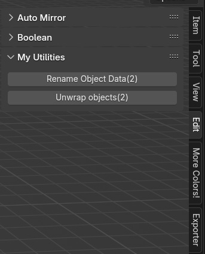

# My Blender Utils
A few scripts, bundled into an add-on. Used to automate some tasks in the 3D modeling software [Blender](https://www.blender.org/).
- Rename Object Data - used for batch renaming data associated with objects to the object name. It has some safeguards for when multiple objects reference the same data.
- Unwrap Objects - used to UV unwrap all selected objects. By default, when doing it natively, Blender unwraps all the objects into the same UV space. This script makes sure that each object occupies the entire UV space.

  

